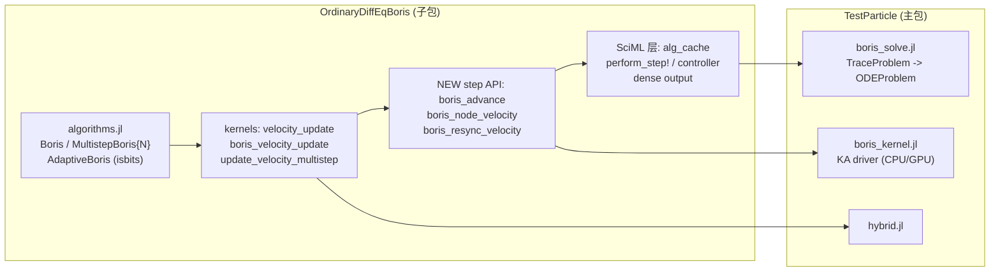

## 需求背景

在 `feat-ordinarydiffeqboris` 分支上，Boris 系列求解器已经被拆成独立子包 `lib/OrdinaryDiffEqBoris`，以 SciML 标准算法的形式实现（`OrdinaryDiffEqAlgorithm` + cache + `perform_step!` + controller + dense output）。用户要求基于已有的代码审查结论，产出一份落地实施计划。

## 目标

把"子包化"这件事真正兑现成 GPU 可移植性，同时消除拆分过程中留下的重复与反向耦合：

1. **物理内核只保留一份**。目前 `boris_velocity_update` / `update_velocity` 在子包与主包 `src/boris/boris.jl` 中各有一份且内容完全相同，分别被 KA 内核路径与 `hybrid.jl` 使用。
2. **抽出无状态的函数式 step API**。现有状态通过修改 `mutable struct` 缓存（`cache.v_half`、`cache.dt_prev`）传递，无法进入 GPU 核函数；需要一层纯函数式的推进接口，让 SciML 循环与 KA 内核都成为它的消费者。
3. **GPU 路径复用同一份实现**，并把当前只接受具体类型 `alg::Boris` 的限制放宽到 `MultistepBoris{N}`（算法均为 isbits，可直接进核函数），未支持的算法给出清晰报错。
4. **把 `AbstractBoris` union 与自适应判断下沉到子包**，去掉父包里的 `hasfield(typeof(alg), :safety)` 这类脆弱判断。
5. **处理每步两次场求值的代价**：SciML 循环每步为给 `integrator.u` 一个同步好的节点速度而多求值一次场，实测 1000 步为 2001 次 vs KA 路径 1002 次，100 万步耗时 0.0794 s vs 0.0222 s。需先量化再决策。

## 非目标

- 不改变任何公开 API 的行为与数值结果（`TestParticle.Boris`、`AdaptiveBoris`、`MultistepBoris2/4/6`、`AdaptiveMultistepBoris`、`AdaptiveHybrid`、`solve(prob, alg)`、`solve(prob, alg, backend)`、`get_fields`、`get_work` 全部保持兼容，现有硬编码期望值需逐位不变）。
- 不把 SciML 的 solve 循环本身搬上 GPU（不可行），GPU 载体是物理内核加 KA driver。
- 不在本轮把 KA 部分搬进子包做成 weak dep extension（留作后续评估）。

## 技术栈

沿用项目现状：Julia 1.11+，子包 `OrdinaryDiffEqBoris` 依赖 `OrdinaryDiffEqCore` / `SciMLBase` / `StaticArrays` / `MuladdMacro` / `LinearAlgebra` / `Reexport`；主包 `TestParticle` 依赖 `KernelAbstractions` / `Adapt` / `ForwardDiff` 等。测试用 `Test`，benchmark 用现有 `benchmark/benchmarks.jl` 的 BenchmarkTools suite。GPU 侧继续走 `KernelAbstractions` 的后端无关路线（`CPU()` 在 CI 中可跑）。

## 实施思路

核心策略是**反向的一步**：不是继续拆分，而是在子包里抽出一层无分配、无状态、只依赖三个访问器（`get_q2m` / `get_EField` / `get_BField`）与 isbits 算法对象的推进函数，让 SciML 的 `perform_step!` 和 KA 的 `@kernel` 同时消费它。这样 CPU 与 GPU 走的是同一份物理，算法变体（`MultistepBoris{N}`）进 GPU 几乎免费。



### 关键决策与权衡

- **函数式 step API 而非改造缓存**：`mutable struct` 的字段写入无法被 GPU 核函数捕获，给缓存加 `Adapt` 规则是治标。抽纯函数后，`perform_step!` 退化为十几行的包装，GPU driver 直接调同一函数，两边数值必然一致。
- **算法对象保持 isbits 是硬约束**：`MultistepBoris{N}`（一个 `n::Int`）与 `AdaptiveMultistepBoris{N,T}`（`n::Int`、`safety::T`）可直接作为内核参数（配合 `@Const`）。必须在子包注释里写明"禁止把场函数或 `Field` 对象放进 `alg`"，否则 GPU 传递会失效。
- **GPU 只支持固定步长变体**：`Boris` 与 `MultistepBoris{N}`。自适应系列的步长控制发生在 host 侧的 controller，单指令流内核里做不到；对 `AdaptiveBoris` / `AdaptiveMultistepBoris` 在 KA 入口抛 `ArgumentError` 并列出支持列表，而不是静默回落。
- **每步两次场求值先量化再动**：SciML 要求每步结束时 `integrator.u` 是同步的节点状态，这是协议成本，无法在 `perform_step!` 内"惰性化"。可选缓解是让节点速度复用本步已求值的场（省一半场求值，代价是输出速度相位精度略降）。该决策必须基于 benchmark 数字，并在 PR 里报告；若不可接受，则在文档中明确 KA 路径是吞吐路径。
- **重复内核直接删除而非保留别名**：`update_velocity` 与 `boris_velocity_update` 都未在主包导出，属内部符号，改名/删除的安全边界可控。

### 性能要点

- 新 step API 必须全程 `@inline`、零分配（输入 `SVector`，返回元组或 `SVector`），子包测试里用 `@allocated` 断言。
- `velocity_update` 内部每调用求值一次 E 和 B；GPU 路径应保持在"一步一次场求值 + 仅在保存时刻同步"，与旧 `master` 的 `_boris_loop!` 行为一致，避免相对历史版本的性能回退。
- KA 路径中把 `p` 的解构（`q2m, _, Efunc, Bfunc, _ = p`）换成访问器调用，或在 host 侧一次性取出 `(q2m, Efunc, Bfunc)` 传入内核，减少内核捕获体积。

## 执行细节

- **行宽 < 92 字符**；函数调用带关键字参数时用显式 `;`；避免 `Any`；只在必要时写注释，新增对外 API 写 docstring（AGENTS.md）。
- **严禁手改 `Manifest.toml`**；本轮不需要增删依赖，因此不动 `Project.toml`。
- **测试文件规范**：新测试文件以 `test_` 为前缀、文件内定义独立 `module test_xxx ... end`、顶部显式声明所需 `using`，由 `test/runtests.jl` 以 `@testset "xxx" include("test_xxx.jl")` 引入；不要在 `@testset` 内部写 `using` / `import` / `struct`，鼓励 `let` 块隔离用例。
- **数值回归基准**：`test/test_boris.jl`、`test/test_adaptive_boris.jl`、`test/test_adaptive_multistep_boris.jl`、`test/test_hybrid.jl`、`test/test_symplectic.jl` 里有大量硬编码期望值。由于物理内核是字符级相同的搬迁，结果应逐位不变；任何一位变化都说明搬迁引入了差异，必须追查而不是改期望值。
- **提交信息**：`component: Brief summary` 标题 + 正文简述目的。

## 目录结构与文件清单

```
lib/OrdinaryDiffEqBoris/
├── src/
│   ├── OrdinaryDiffEqBoris.jl     # [MODIFY] 新增 include("boris_step.jl")；扩展导出列表
│   │                              #   (AbstractBoris, isadaptive, velocity_update,
│   │                              #    boris_velocity_update, update_velocity_multistep,
│   │                              #    boris_advance, boris_node_velocity, boris_resync_velocity)
│   ├── boris_perform_step.jl      # [MODIFY] 保留 velocity_update / boris_velocity_update /
│   │                              #   update_velocity_multistep；boris_initialize! 与 boris_advance!
│   │                              #   改为调用新的 step API（行为不变）
│   └── boris_step.jl              # [NEW] 无状态函数式推进 API 与其 docstring
├── test/
│   ├── runtests.jl                # [MODIFY] 以 @testset include 引入新测试文件
│   └── test_step_api.jl           # [NEW] module test_step_api：step API 与 perform_step! 一致性、
│                                  #   dt 变化重同步的能量守恒、零分配断言
src/
├── types.jl                       # [MODIFY] 删除本地 AbstractBoris union，改为引用子包导出
├── boris/
│   ├── boris.jl                   # [MODIFY] 删除重复的 boris_velocity_update 与 update_velocity；
│   │                              #   保留 get_EField/get_BField 的 Problem/Solution 扩展与
│   │                              #   _prepare_saved_data / get_fields / get_work
│   ├── boris_solve.jl             # [MODIFY] 用子包 isadaptive 替换 _boris_isadaptive
│   └── boris_kernel.jl            # [MODIFY] 调用子包 step API；alg 类型放宽到 GPU 支持子集；
│                                  #   新增 GPUBorisAlgorithm 常量与不支持算法的 ArgumentError
├── hybrid.jl                      # [MODIFY] 6 处 update_velocity 调用改为 velocity_update(..., Boris())
└── TestParticle.jl                # [MODIFY] import 子包新的内核与 step API 符号；export 列表保持不变
test/
├── runtests.jl                    # [MODIFY] 引入 test_boris_gpu.jl
└── test_boris_gpu.jl              # [NEW] module test_boris_gpu：CPU() 后端下 SciML 路径与 KA 路径
                                   #   数值一致、MultistepBoris 的 GPU 支持、自适应算法入口报错
docs/src/tutorial/boris.md         # [MODIFY] 补充 GPU 支持子集与"节点同步导致两次场求值"的说明
docs/examples/features/demo_gpu.md # [MODIFY] 示例更新为可用的算法范围
benchmark/benchmarks.jl            # [MODIFY] 视结论补充/对齐 Boris 与 Boris kernel 的对比项
```

## 关键接口

```
# lib/OrdinaryDiffEqBoris/src/boris_step.jl
"""
    boris_advance(r, v_half, dt, t, p, alg) -> (r_new, v_half_new)

推进一个完整步：`v_half` 是 t - dt/2 处的半步速度，场取在 (r, t + dt/2)；
返回新位置与新的半步速度。无状态、无分配，可被 GPU 内核直接调用。
"""
@inline boris_advance(r, v_half, dt, t, p, alg)

"""
    boris_node_velocity(r, v_half, dt, t, p, alg) -> v_node

由半步速度重建节点速度（输出用），场取在 (r, t)。
"""
@inline boris_node_velocity(r, v_half, dt, t, p, alg)

"""
    boris_resync_velocity(v_half, r, dt_prev, dt, t, p, alg) -> v_half_new

步长改变时把半步速度重新居中到新的半步位置，维持时间可逆性。
"""
@inline boris_resync_velocity(v_half, r, dt_prev, dt, t, p, alg)
```

## 风险与验证

- 风险 1：搬迁后硬编码期望值漂移。验证：跑整套 `test`（激活 `test` workspace 后 `test`），并单独跑 `lib/OrdinaryDiffEqBoris` 的测试。
- 风险 2：`hybrid.jl` 的参数布局与访问器不一致（`TraceGCProblem` 用的是 `(q, q2m, μ, E, B)`）。验证：改动前确认 hybrid 的 `p` 是标准 `(q2m, m, E, B, F)` 布局，`test_hybrid.jl` 全绿即为通过。
- 风险 3：`@allocated` 断言在 CI 机器上抖动。验证：只对 `SVector` 输入、无保存逻辑的 step API 断言 `== 0`，阈值不写死。
- 风险 4：放宽 KA 入口类型后与 `solve(prob::TraceProblem, alg::AbstractBoris; ...)` 产生歧义。验证：KA 版本的首参签名带 `backend::Backend`，类型不同不会歧义；补一条 `MethodError`/分派归属测试。

## Agent Extensions

### SubAgent

- **code-explorer**
- 用途：在第 1 步搬迁前做影响面分析，穷举 `update_velocity` / `boris_velocity_update` / `velocity_update` 的全部调用点与参数布局（`hybrid.jl`、`boris_kernel.jl`、`test/` 中的间接引用），确认删除主包副本不会漏掉调用。
- 预期产出：完整的调用点清单与参数布局结论，作为删除动作的安全依据。
- **julia-pro**
- 用途：承担 Julia 侧的实现工作，包括子包 step API 的 `@inline` 无分配写法、`perform_step!` 重构、KA 内核改造，以及按 AGENTS.md 规范编写 `module test_xxx` 形式的测试。
- 预期产出：符合 Julia 惯用法与 SciML 接口约定的代码，测试可在 REPL 单独运行并通过。