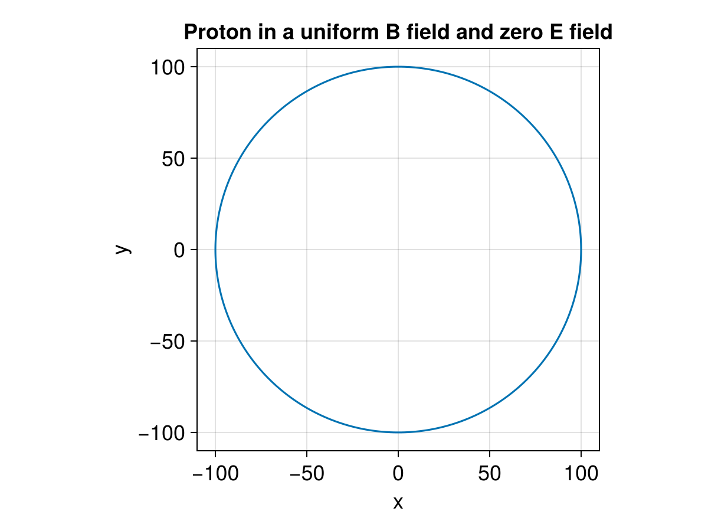

---


title: Energy Conservation id: demo_energy_conservation date: 2023-10-27 author: &quot;[Hongyang Zhou](https://github.com/henry2004y)&quot; julia: 1.9.3 description: Demonstrate energy conservation in uniform fields. –-

This example demonstrates the energy conservation of a single proton motion in two cases. The first one is under a uniform B field and zero E field. The second on is under a zero B field and uniform E field.

```julia
using TestParticle, OrdinaryDiffEq, StaticArrays
using TestParticle: ZeroField
import TestParticle as TP
using LinearAlgebra: ×
using CairoMakie

const B₀ = 1e-8 # [T]
const E₀ = 3e-2 # [V/m]

"""
f2
"""
location!(dx, v, x, p, t) = dx .= v

"""
f1
"""
function lorentz!(dv, v, x, p, t)
   q2m, _, E, B = p
   dv .= q2m*(E(x, t) + v × (B(x, t)))
end

### Initialize field

uniform_B(x) = SA[0, 0, B₀]

uniform_E(x) = SA[E₀, 0.0, 0.0]

zero_B = ZeroField()
zero_E = ZeroField()

"""
Check energy conservation.
"""
E(vx, vy, vz) = 1 // 2 * (vx^2 + vy^2 + vz^2)

### Initialize particles

x0 = [0.0, 0, 0]
v0 = [0.0, 1e2, 0.0]
stateinit = [x0..., v0...]
tspan_proton = (0.0, 2000.0);
```


Uniform B field and zero E field

```julia
param_proton = prepare(zero_E, uniform_B, species = Proton)

### Solve for the trajectories

prob_p = DynamicalODEProblem(lorentz!, location!, v0, x0, tspan_proton, param_proton)

Ωᵢ = TP.qᵢ * B₀ / TP.mᵢ
Tᵢ = 2π / Ωᵢ
println("Number of gyrations: ", tspan_proton[2] / Tᵢ)

sol = solve(prob_p, ImplicitMidpoint(), dt = Tᵢ/15)

f = Figure(fontsize = 18)
ax = Axis(f[1, 1],
   title = "Proton in a uniform B field and zero E field",
   xlabel = "x",
   ylabel = "y",
   aspect = 1
)

lines!(ax, sol, idxs = (1, 2))
```

{width=600px height=450px}

Zero B field and uniform E field

```julia
param_proton = prepare(uniform_E, zero_B, species = Proton)

# acceleration, [m/s²]
a = param_proton[1] * E₀
# predicted final speed, [m/s]
v_final_predict = a * tspan_proton[2]
# predicted travel distance, [m/s]
d_final_predict = 0.5 * tspan_proton[2] * v_final_predict
# predicted energy gain, [eV]
E_predict = E₀ * d_final_predict

prob_p = DynamicalODEProblem(lorentz!, location!, v0, x0, tspan_proton, param_proton)

sol = solve(prob_p, Vern6())

energy = map(x -> E(x[1:3]...), sol.u) .* TP.mᵢ;
```


Predicted final speed

```ansi
predicted final speed: 5.744086746808526e9 [m/s]
```


Simulated final speed

```ansi
simulated final speed: 5.744086746808613e9 [m/s]
```


Predicted travel distance

```ansi
predicted travel distance: 5.744086746808526e12 [m]
```


Simulated travel distance

```ansi
simulated travel distance: 5.74408674676843e12 [m]
```


Predicted final energy

```ansi
predicted energy gain: 1.723226024042558e11 [eV]
```


Simulated final energy

```ansi
simulated final energy: 1.7232260240426102e11 [eV]
```

