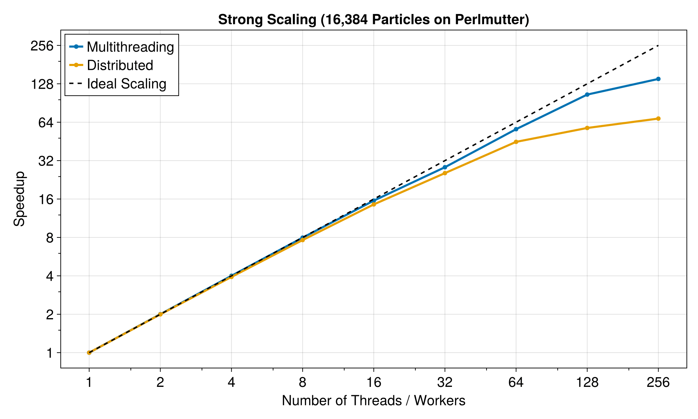

```@meta
CurrentModule = TestParticle
```

# TestParticle.jl

TestParticle.jl is a flexible tool for tracing charged particles in electromagnetic or body force fields. It supports three-dimensional particle tracking in both relativistic and non-relativistic regimes.

The package handles field definitions in two ways:

- *Analytical Fields*: User-defined functions that calculate field values at specific spatial coordinates.

- *Numerical Fields*: Discretized fields constructed directly with coordinates or using [Meshes.jl](https://github.com/JuliaGeometry/Meshes.jl) and interpolated via [FastInterpolations.jl](https://projecttorreypines.github.io/FastInterpolations.jl/stable/).

The core trajectory integration is powered by and tight to the [DifferentialEquations.jl](https://github.com/SciML/DifferentialEquations.jl) ecosystem, solving the Ordinary Differential Equations (ODEs) of motion.

To accommodate different performance needs, the API provides:

- *In-place versions*: Functions ending in `!`.

- *Out-of-place versions*: Functions optimized with StaticArrays. Note that this requires the initial conditions to be passed as a static vector.

For a theoretical background on the physics involved, please refer to [Single-Particle Motions](https://henry2004y.github.io/KeyNotes/contents/single.html).

## Installation

```julia
julia> ]
pkg> add TestParticle
```

## Usage

Familiarity with the [DifferentialEquations.jl](https://github.com/SciML/DifferentialEquations.jl) workflow is recommended, as TestParticle.jl builds directly upon its ecosystem.

The primary role of this package is to automate the construction of the ODE system based on Newton's second law. This allows users to focus on defining the field configurations and particle initial conditions. For practical demonstrations, please refer to the examples.

In addition to standard integrators, TestParticle.jl includes a native implementation of the Boris solver. It exposes an interface similar to DifferentialEquations.jl for ease of adoption. Further details are provided in the subsequent sections. Check more in [examples](@ref).

## Performance and Scaling

Tracing many particles can be computationally intensive. TestParticle.jl is designed to scale across multiple cores and machines using Julia's built-in parallel computing capabilities.

### Serial Performance

The following table compares the performance of TestParticle's Boris solver against standard ODE solvers from DifferentialEquations.jl for a single particle simulation.

**Benchmark Configuration:**
- Hardware: Intel Ultra 7 265K
- Task: Simulating 1 particle for 0.1 second with $dt = 1$ ns ($10^8$ steps).

| Solver | Median Time | Speedup | Allocations | Memory |
| :--- | :--- | :--- | :--- | :--- |
| TestParticle Boris | 923 ms | 1.0x | 8 | 55.12 KiB |
| ODE Tsit5 (fixed) | 15773 ms | 17x slower | 64 | 3.74 KiB |
| ODE Vern9 (fixed) | 39555 ms | 43x slower | 72 | 4.35 KiB |

### Parallel Scaling

TestParticle.jl supports both multithreading and distributed computing for ensemble simulations. The following results were obtained on a Perlmutter 1 CPU node (2x AMD EPYC 7763). The multithreading performance is measured using `EnsembleThreads()`, while the distributed performance is measured using `EnsembleDistributed()`.



## Presentations

For interactive presentations and educational materials, please check out these Pluto notebooks:

- [TestParticle.jl: A New Tool for An Old Problem](https://henry2004y.github.io/pluto_playground/testparticle_202401.html)
- [基于开源工具链的测试粒子模型 (Test Particle Model Based on Open Source Toolchain)](https://henry2004y.github.io/pluto_playground/testparticle_202212.html)

### Publications

- Zhang, Chi, Hongyang Zhou, Chuanfei Dong, Yuki Harada, Masatoshi Yamauchi, Shaosui Xu, Hans Nilsson, et al. 2024. “Source of Drift-Dispersed Electrons in Martian Crustal Magnetic Fields.” The Astrophysical Journal 972 (2): 153. https://doi.org/10.3847/1538-4357/ad64d5.

## Acknowledgement

`TestParticle.jl` is acknowledged by citing the Zenodo DOI: [](https://doi.org/10.5281/zenodo.10149789).

Nothing can be done such easily without the support of the Julia community. We appreciate all the contributions from developers around the world.
