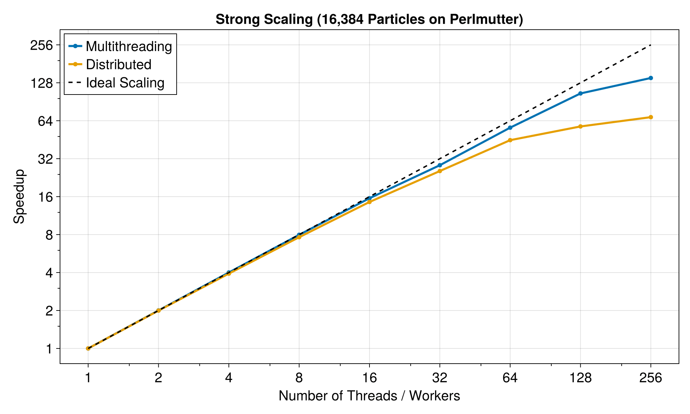

```@meta
CurrentModule = TestParticle
```

# TestParticle.jl

TestParticle.jl is a flexible tool for tracing charged particles in electromagnetic or body force fields. It supports three-dimensional particle tracking in both relativistic and non-relativistic regimes.

The package handles field definitions in two ways:

- *Analytical Fields*: User-defined functions that calculate field values at specific spatial coordinates.

- *Numerical Fields*: Discretized fields constructed directly with coordinates or using [Meshes.jl](https://github.com/JuliaGeometry/Meshes.jl) and interpolated via [FastInterpolations.jl](https://projecttorreypines.github.io/FastInterpolations.jl/stable/).

The core trajectory integration is powered by and tight to the [DifferentialEquations.jl](https://github.com/SciML/DifferentialEquations.jl) ecosystem, solving the Ordinary Differential Equations (ODEs) of motion.

To accommodate different performance needs, the API provides:

- *In-place versions*: Functions ending in `!`.

- *Out-of-place versions*: Functions optimized with StaticArrays. Note that this requires the initial conditions to be passed as a static vector.

For a theoretical background on the physics involved, please refer to [Single-Particle Motions](https://henry2004y.github.io/KeyNotes/contents/single.html).

## Installation

```julia
julia> ]
pkg> add TestParticle
```

## Usage

Familiarity with the [DifferentialEquations.jl](https://github.com/SciML/DifferentialEquations.jl) workflow is recommended, as TestParticle.jl builds directly upon its ecosystem.

The primary role of this package is to automate the construction of the ODE system based on Newton's second law. This allows users to focus on defining the field configurations and particle initial conditions. For practical demonstrations, please refer to the examples.

In addition to standard integrators, TestParticle.jl includes a native implementation of the Boris solver. It exposes an interface similar to DifferentialEquations.jl for ease of adoption. Further details are provided in the subsequent sections. Check more in [examples](@ref).

## Performance and Scaling

Tracing many particles can be computationally intensive. TestParticle.jl is designed to scale across multiple cores and machines using Julia's built-in parallel computing capabilities.

### Serial Performance

The following table compares the performance of TestParticle's Boris solver against standard ODE solvers from DifferentialEquations.jl for a single particle simulation. Reproducible benchmark scripts are available in [benchmark/bench_serial.jl](https://github.com/henry2004y/TestParticle.jl/blob/master/benchmark/bench_serial.jl).

**Benchmark Configuration:**
- Hardware: Intel Core Ultra 7 265K (20 cores, 20 threads)
- Task: Simulating 1 particle for 0.1 second with $dt = 1$ ns ($10^8$ steps, saving endpoint).

| Solver | Median Time | Speedup | Allocations | Memory |
| :--- | :--- | :--- | :--- | :--- |
| TestParticle Boris | 477 ms | 1.0x | 91 | 4.83 KiB |
| ODE Tsit5 (fixed) | 10392 ms | 22x slower | 66 | 4.04 KiB |
| ODE Vern9 (fixed) | 24962 ms | 52x slower | 74 | 4.70 KiB |

### Parallel Scaling

TestParticle.jl supports both multithreading and distributed computing for ensemble simulations on CPUs. The following results were obtained on a Perlmutter 1 CPU node (2x AMD EPYC 7763). The multithreading performance is measured using `EnsembleThreads()`, while the distributed performance is measured using `EnsembleDistributed()`.



### GPU Performance and Multi-Backend Scaling

TestParticle.jl provides vendor-agnostic GPU acceleration via
[KernelAbstractions.jl](https://github.com/JuliaGPU/KernelAbstractions.jl). Passing a GPU
backend such as `CUDA.CUDABackend()`, `AMDGPU.ROCBackend()`, `Metal.MetalBackend()`, or
`oneAPI.oneAPIBackend()` to `solve(prob, Boris(), backend)` executes the Boris pusher
kernels directly on hardware accelerators.

**Benchmark Environments:**
- **Workstation (Consumer GPU):** Intel Core Ultra 7 265K (20 cores, 20 threads),
  NVIDIA GeForce RTX 5070 (12 GB GDDR7)
- **HPC Node (Datacenter GPU):** NERSC Perlmutter node, AMD EPYC 7763 (128 threads),
  NVIDIA A100-SXM4-40GB

Reproducible benchmark scripts are available in
[`benchmark/compare_boris_backends.jl`](https://github.com/henry2004y/TestParticle.jl/blob/master/benchmark/compare_boris_backends.jl).

#### 1. Analytical Uniform Field Tracing (1,000 steps)

Times below report the median wall time for an ensemble of particles traced over 1,000
steps on the RTX 5070 workstation. Speeds in parentheses are relative to CPU Serial:

| Number of Particles $N$ | CPU Serial (FP64) | CPU Threads (20 Thr) | KA CPU (FP64) | GPU (FP64) | GPU (FP32) |
| :--- | :--- | :--- | :--- | :--- | :--- |
| 1,000 | 14.15 ms | 1.62 ms (8.7x) | 0.79 ms (18.0x) | 2.27 ms (6.2x) | 0.52 ms (27.4x) |
| 10,000 | 167.31 ms | 12.89 ms (13.0x) | 5.76 ms (29.1x) | 3.09 ms (54.2x) | 0.85 ms (196.9x) |
| 100,000 | 1521.67 ms | 166.30 ms (9.2x) | 43.22 ms (35.2x) | 23.40 ms (65.0x) | 5.30 ms (286.9x) |

When returning raw matrix output (`raw_output = true` with a bulk initial state matrix,
omitting per-particle `ODESolution` wrapper assembly), host overhead is eliminated:
at $N = 100,000$, KA CPU completes in **37.69 ms**, GPU (FP64) in **13.29 ms**, and
GPU (FP32) in **1.22 ms** ($>8.1 \times 10^{10}$ particle-steps/s end-to-end). On the
Perlmutter A100, the same 100,000-particle ensemble completes in **2.33 ms** (FP64) and
**1.22 ms** (FP32).

#### 2. 3D Grid Field Interpolation ($32^3$ Grid, 200 steps, Float32)

For discrete electromagnetic grids, TestParticle.jl automatically converts grid
interpolations into device-native
[`GPUGrid3D`](https://github.com/henry2004y/TestParticle.jl/blob/master/src/utility/gpu_grid.jl)
structures with hardware register trilinear evaluation:

| Number of Particles $N$ | CPU Threads (20 Thr) | KA CPU (Fair Baseline) | GPU (Default API) | GPU (Raw Output) |
| :--- | :--- | :--- | :--- | :--- |
| 2,000 | 3.39 ms | 1.67 ms (2.0x) | 0.95 ms (3.6x) | 0.75 ms (4.5x) |
| 10,000 | 11.29 ms | 6.34 ms (1.8x) | 1.64 ms (6.9x) | 0.74 ms (15.3x) |
| 50,000 | 79.71 ms | 23.99 ms (3.3x) | 4.40 ms (18.1x) | 1.26 ms (63.3x) |

> [!NOTE]
> `CPU Threads` allocates one `ODESolution` per particle, which dominates the runtime
> for grid fields. `KA CPU` provides the fair parallel CPU baseline by batching particle
> updates without per-particle object allocation overhead.

#### 3. Kernel Isolation and Theoretical Peak Performance

Because Boris integration holds particle coordinates and velocities entirely in
GPU registers throughout the step loop, the kernel performs zero DRAM reads or writes
between $t_0$ and $t_{\text{end}}$. A linear regression $t = a + b \cdot \text{steps}$
isolates host initialization / wrapper overhead ($a$) from the pure hardware pusher
throughput ($b$):

- **NVIDIA A100 (Perlmutter):**
  - **FP32:** $385.1 \times 10^9$ particle-steps/s ($b = 0.0026\text{ ms} / \text{step}$
    per $10^6$ particles), achieving $\approx 20.0\text{ TFLOPS}$ (~100% of the A100
    peak vector FP32 compute of 19.5 TFLOPS).
  - **FP64:** $191.6 \times 10^9$ particle-steps/s ($b = 0.0052\text{ ms} / \text{step}$
    per $10^6$ particles), achieving $\approx 10.0\text{ TFLOPS}$ (~100% of the A100
    peak FP64 compute of 9.7 TFLOPS).
  - The measured FP32:FP64 speedup ratio is **2.00x**, exactly matching the 2:1 ALU
    hardware architecture of the A100.
- **NVIDIA RTX 5070 (Workstation):**
  - **FP32:** $625.4 \times 10^9$ particle-steps/s ($b = 0.0016\text{ ms} / \text{step}$
    per $10^6$ particles), delivering $\approx 31.2\text{ TFLOPS}$ (>80% of peak compute).
  - **FP64:** $9.4 \times 10^9$ particle-steps/s, demonstrating a **62.4x** FP32 speedup
    that reflects the 1:64 FP64 ALU throttling inherent to consumer GeForce GPUs.
- **$32^3$ Grid Interpolation:**
  - Sustains $55.5 \times 10^9$ particle-steps/s on A100 and $48.2 \times 10^9$
    particle-steps/s on RTX 5070, saturating GPU L1/L2 cache read bandwidth with
    trilinear evaluations.

### Precision Considerations: Float64 vs Float32

TestParticle.jl supports both double precision (`Float64`) and single precision
(`Float32`) tracing. Supplying `Float32` coordinates, velocities, or time span
automatically promotes the simulation parameters, physical constants, and equations
to single precision.

#### Advantages of Float32
- **Massive Consumer GPU Speedups:** Consumer-grade GPUs (e.g., NVIDIA GeForce RTX
  30/40/50 series) feature a 1:64 FP64 ALU throughput throttle. Switching to `Float32`
  unlocks the full hardware compute rate, yielding over **60x** faster pure kernel
  execution. On datacenter GPUs (e.g., NVIDIA A100), `Float32` yields the theoretical
  **2x** speedup over full-rate FP64 ALUs.
- **Lower Memory Footprint:** Halves VRAM and host memory consumption for trajectory
  buffers and 3D electromagnetic grids, reducing memory bandwidth pressure.
- **Reduced Host Overhead:** Memory allocations and data transfers across the PCIe bus
  are halved in size.

#### Trade-offs and Limitations of Float32
- **Accumulated Numerical Drift:** With 24 bits of mantissa (~7 significant decimal
  digits), rounding errors accumulate over long integration periods ($>10^5$ gyro-orbits),
  potentially leading to phase errors or slight artificial energy drift in non-integrable fields.
- **Dynamic Range / Catastrophic Cancellation:** In unnormalized SI units with large
  coordinate baselines (e.g. planetary magnetospheres where $r \sim 10^7$ m, but gyroradii
  or step increments are in centimeters or meters), `Float32` suffers from catastrophic
  cancellation in spatial increments.
- **Recommendations:**
  - Use **`Float64`** for high-precision single-particle tracing, long-duration orbital
    dynamics, and planetary-scale simulations using unnormalized SI units.
  - Use **`Float32`** for large statistical ensembles ($N \ge 10^5$), kinetic/MHD
    distribution studies, normalized coordinate systems (e.g., lengths normalized to
    ion inertial length or gyroradius), and high-throughput GPU workloads.
  - For large ensembles ($N \ge 10^5$), set **`raw_output = true`** to bypass per-particle
    `ODESolution` Julia object allocation and achieve near-pure kernel throughput.

## Presentations

For interactive presentations and educational materials, please check out these Pluto notebooks:

- [TestParticle.jl: A New Tool for An Old Problem](https://henry2004y.github.io/pluto_playground/testparticle_202401.html)
- [基于开源工具链的测试粒子模型 (Test Particle Model Based on Open Source Toolchain)](https://henry2004y.github.io/pluto_playground/testparticle_202212.html)

## Publications

- Zijin Zhang, Anton V. Artemyev, and Vassilis Angelopoulos, 2025, "Quantification of ion scattering by solar-wind current sheets: Pitch-angle diffusion rates", Phys. Rev. E, https://doi.org/10.1103/pkzv-k5t3
- Chi Zhang, Hongyang Zhou, Chuanfei Dong, Yuki Harada, Masatoshi Yamauchi, Shaosui Xu, Hans Nilsson, et al. 2024. “Source of Drift-Dispersed Electrons in Martian Crustal Magnetic Fields”, The Astrophysical Journal, https://doi.org/10.3847/1538-4357/ad64d5.

## Acknowledgement

`TestParticle.jl` is acknowledged by citing the Zenodo DOI: [](https://doi.org/10.5281/zenodo.10149789).

Nothing can be done such easily without the support of the Julia community. We appreciate all the contributions from developers around the world.
