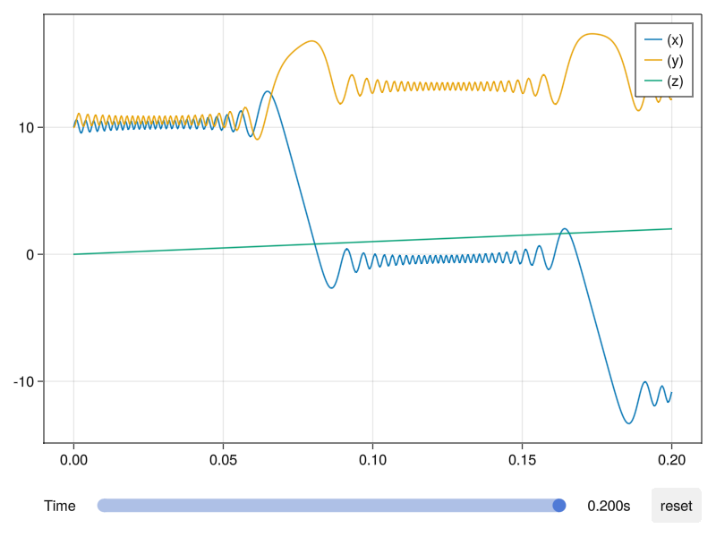
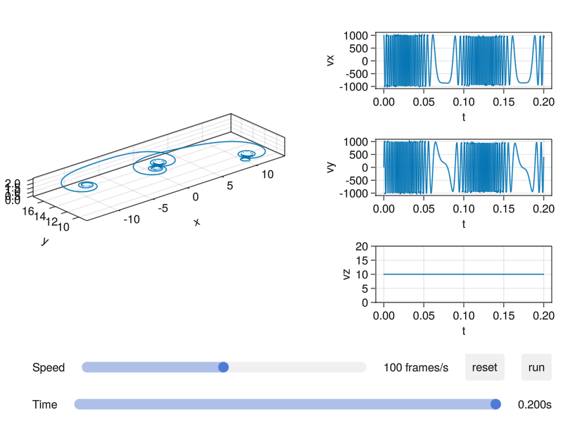

# Plot Functions

Before using the plot recipes of `Testparticle.jl`, you need to import `Makie` package via `using GLMakie` or `using CairoMakie`, which depends on your choice for the backend. All plot recipes depend on `Makie.jl`.

## Convention

By convention, we use integers to represent the 7 dimensions in the input argument `vars` for all plotting methods:

| Component | Meaning |
|-----------|---------|
| 0         | time    |
| 1         | x       |
| 2         | y       |
| 3         | z       |
| 4         | vx      |
| 5         | vy      |
| 6         | vz      |

## Basic usage

The simplest usage is directly calling the `plot` or `lines` function provided by `Makie`. For example,

```julia
plot(sol)
```

Without other arguments, it will plot the 3d orbit of this particle. Other types of plots are supported, and you can use the keyword argument `vars` to choose the variables to be plotted. The basic form for `vars` is a Tuple. For example, if you want to plot the variable `x` as a function of time or the orbit, you can use it like this:

```julia
plot(sol, vars=(0, 1))  # 0 represents time, 1 represents x
plot(sol, vars=(1, 2, 3))
```

If you want to plot a function of time, position or velocity, you can first define the function. The arguments of the function must be a 7-dimensional array, the elements of which correspond to the phase space coordinates and time, and the return value must be a Number. For example,

```julia
Eₖ(xu) = mₑ*(xu[4]^2 + xu[5]^2 + xu[6]^2)/2
lines(sol, vars=(0, Eₖ))
```

This command will plot the kinetic energy as a function of x. The above form is equivalent to

```julia
lines(sol, vars=Eₖ)
lines(sol, vars=1)
```

When the independent variable is not explicitly given, it will be set as time by default.

Because of the restriction of `Makie.jl`, `plot` and `lines` function cannot plot multiple lines at one call. If you want to plot multiple quantities in one figure, you may consider using `plot!`, `lines!` or the another plot recipe `orbit`.

You can choose the plotting time span via the keyword argument `tspan`. For example,

```julia
lines(sol, tspan=(0, 1))
```

If the default axis or labels are too small, you can first create the customized figure and axis, and then plot inside:

```julia
f = Figure(size=(1200, 800), fontsize=18)
ax = Axis3(f[1,1],
    title = "Particle trajectory",
    xlabel = "X",
    ylabel = "Y",
    zlabel = "Z",
)

plot!(sol)
```

Currently we do not directly support plotting multiple particle trajectories saved as the type `EnsembleSolution`. However, plotting multiple trajectories can be done with a simple loop:

```julia
f = Figure()
ax = Axis3(f[1,1])
for i in eachindex(sol)
    lines!(sol[i], label="$i")
end
Legend(f[1,2], ax, nbanks=1, label=L"p")
f
```

## Advanced usage

There are two plot recipes, which are more powerful than just using `plot` or `lines`. The `orbit` is designed to track the orbit of a particle or the variation of other variables. The panels can be updated on-the-fly interactively. The `monitor` is designed to monitor the variation of some physics quantities during the evolution of the orbit.

### `orbit`

The basic usages of `orbit` are the same as other functions described above with the same arguments. Multiple quantities from one particle solution can be plotted in the same axis. For example,

```julia
orbit(sol, vars=[1, (1, 2), Eₖ])
```

If a tuple contains vectors, they will be expanded automatically. For example,

```julia
orbit(sol, vars=(0, [1, 2, 3]))
orbit(sol, vars=([1, 2, 3], [4, 5, 6]))
```

are equivalent to

```julia
orbit(sol, vars=[(0, 1), (0, 2), (0, 3)])
orbit(sol, vars=[(1, 4), (2, 5), (3, 6)])
```

#### Interactive components



The slider can control the time span, and the maximum of time span will be displayed on the right of the slider.

The `reset` button can reset the scale of lines when the axis limits change. When you drag the slider, clicking `reset` button will reset the axis limits to fit the data.

### `monitor`

The usage of `vars` for this function is different from those in `orbit`. It can only be a list and its length is equal to 3. The type of its elements must be an Integer or Function. The form of the function is same as those prescribed by `orbit`. For example,

```julia
Eₖ(xu) = mₑ*(xu[4]^2 + xu[5]^2 + xu[6]^2)/2
monitor(sol, vars=[1, 2, Eₖ])
```

#### Interactive components

```@raw html
<video width="75%" height="auto" controls loop>
<source src="https://raw.githubusercontent.com/TCLiuu/TestParticleResource/master/videos/monitor.mp4?raw=true" type="video/mp4">
</video>
```



After first click of the `run` button, the evolution of the orbit will be displayed from the beginning. For other times, it will start from the time set by the time slider. The functionality of `reset` button is the same as above.

The time slider controls the time span. The speed slider controls the speed of the animation.
