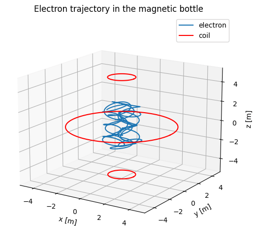

# Tutorial

What makes plasmas particularly difficult to analyze is the fact that the densities fall in an intermediate range. Fluids like water are so dense that the motions of individual molecules do not have to be considered. Collisions dominate, and the simple equations of ordinary fluid dynamics suffice. At the other extreme in very low-density devices, only single-particle trajectories need to be considered; collective effects are often unimportant. Plasma behaves sometimes like fluids, and sometimes like a collection of individual particles. The first step in learning how to deal with this schizophrenic personality is to understand how single particles behave in electric and magnetic fields.

Here we assume that the EM fields are prescribed and not affected by the charged particles. The materials here closely follows F.F.Chen's [Introduction to Plasma Physics and Controlled Fusion](https://link.springer.com/book/10.1007/978-3-319-22309-4).
For more complete notes corresponding to each case, please check out [Single-Particle Motions](https://henry2004y.github.io/KeyNotes/contents/single.html).

In all examples we assume the following packages are loaded:

```@example tutorial
using JSServe: Page # hide
Page(exportable=true, offline=true) # hide
```

```@example tutorial
using TestParticle
using TestParticle: get_gc
using TestParticleMakie
using OrdinaryDiffEq
using StaticArrays
using LinearAlgebra
import WGLMakie as WM
```

## Uniform E and B Fields

### E=0

```@example tutorial
function uniform_B(x)
    return SA[0.0, 0.0, 1e-8]
end

function uniform_E(x)
    return SA[0.0, 0.0, 0.0]
end

x0 = [1.0, 0, 0]
v0 = [0.0, 1.0, 0.1]
stateinit = [x0..., v0...]
tspan = (0, 18)

param = prepare(uniform_E, uniform_B, species=Proton)
prob = ODEProblem(trace!, stateinit, tspan, param)
sol = solve(prob, Tsit5(); save_idxs=[1,2,3,4,5,6])

WM.plot(sol)
```

### Finite E

```@example tutorial
function uniform_B(x)
    return SA[0, 0, 1e-8]
end

function uniform_E(x)
    return SA[1e-9, 0, 0]
end

# trace the orbit of the guiding center
function trace_gc!(dx, x, p, t)
    _, _, E, B, sol = p
    xu = sol(t)
    Bv = B(x)
    b = normalize(Bv)
    v_par = (xu[4:6]⋅b).*b
    B2 = sum(Bv.^2)
    dx[1:3] = (E(x)×Bv)/B2 + v_par
end

x0 = [1.0, 0, 0]
v0 = [0.0, 1.0, 0.1]
stateinit = [x0..., v0...]
tspan = (0, 20)
# E×B drift
param = prepare(uniform_E, uniform_B, species=Proton)
prob = ODEProblem(trace!, stateinit, tspan, param)
sol = solve(prob, Tsit5(); save_idxs=[1,2,3,4,5,6])

gc = get_gc(param)
gc_x0 = [gc_i(stateinit) for gc_i in gc]
prob_gc = ODEProblem(trace_gc!, gc_x0, tspan, (param..., sol))
sol_gc = solve(prob_gc, Tsit5(); save_idxs=[1,2,3])

gc_analytic = Tuple(xu -> getindex(sol_gc(xu[7]), i) for i = 1:3)
# numeric result and analytic result
orbit(sol, vars=[(1, 2, 3), gc, gc_analytic])
```

### Gravitational Field

```@example tutorial
function B(x)
    return SA[0.0, 1e-8, 0.0]
end

function E(x)
    return SA[0.0, 0.0, 0.0]
end
# gravity
function F(x)
    return SA[0.0, 0.0, -TestParticle.mᵢ*9.8]
end
# initial static particle
x0 = [1.0, 0, 0]
v0 = [0.0, 0.0, 0.0]
stateinit = [x0..., v0...]
tspan = (0, 1.0)

param = prepare(E, B, F, species=Proton)
prob = ODEProblem(trace!, stateinit, tspan, param)
sol = solve(prob, Tsit5(); save_idxs=[1,2,3])
# drift in x-direction + free fall in z-direction
WM.plot(sol)
```

## Nonuniform B Field

### ∇B ⊥ B: Grad-B Drift

```@example tutorial
using ForwardDiff: gradient

function grad_B(x)
    return SA[0, 0, 1e-8+1e-9 *x[2]]
end

function uniform_E(x)
    return SA[1e-9, 0, 0]
end

abs_B(x) = norm(grad_B(x))

# trace the orbit of the guiding center
function trace_gc!(dx, x, p, t)
    q, m, E, B, sol = p
    xu = sol(t)
    gradient_B = gradient(abs_B, x)
    Bv = B(x)
    b = normalize(Bv)
    v_par = (xu[4:6]⋅b).*b
    v_perp = xu[4:6] - v_par
    dx[1:3] = m*norm(v_perp)^2*(Bv×gradient_B)/(2*q*norm(Bv)^3) + (E(x)×Bv)/norm(Bv)^2+v_par
end

x0 = [1.0, 0, 0]
v0 = [0.0, 1.0, 0.1]
stateinit = [x0..., v0...]
tspan = (0, 20)
param = prepare(uniform_E, grad_B, species=Proton)
prob = ODEProblem(trace!, stateinit, tspan, param)
sol = solve(prob, Tsit5(); save_idxs=[1,2,3,4,5,6])

gc = get_gc(param)
gc_x0 = [gc_i(stateinit) for gc_i in gc]
prob_gc = ODEProblem(trace_gc!, gc_x0, tspan, (param..., sol))
sol_gc = solve(prob_gc, Tsit5(); save_idxs=[1,2,3])

gc_analytic = Tuple(xu -> getindex(sol_gc(xu[7]), i) for i = 1:3)
# numeric result and analytic result
# The orbit of guiding center includes some high order terms, which is different from the
# formula of magnetic field gradient drift of some textbooks that just preserves the first
# order term.
orbit(sol, vars=[(1, 2, 3), gc, gc_analytic])
```

### Curved B: Curvature Drift

```@example tutorial
using ForwardDiff: gradient, jacobian

function curved_B(x)
    # satisify ∇⋅B=0
    # B_θ = 1/r => ∂B_θ/∂θ = 0
    θ = atan(x[3]/(x[1]+3))
    r = hypot(x[1]+3, x[3])
    return SA[-1e-7*sin(θ)/r, 0, 1e-7*cos(θ)/r]
end

function zero_E(x)
    return SA[0, 0, 0]
end

abs_B(x) = norm(curved_B(x))  # |B|

# trace the orbit of the guiding center
function trace_gc!(dx, x, p, t)
    q, m, E, B, sol = p
    xu = sol(t)
    gradient_B = gradient(abs_B, x)  # ∇|B|
    Bv = B(x)
    b = normalize(Bv)
    v_par = (xu[4:6]⋅b).*b  # (v⋅b)b
    v_perp = xu[4:6] - v_par
    Ω = q*norm(Bv)/m
    κ = jacobian(B, x)*Bv  # B⋅∇B
    # v⟂^2*(B×∇|B|)/(2*Ω*B^2) + v∥^2*(B×(B⋅∇B))/(Ω*B^3) + (E×B)/B^2 + v∥
    dx[1:3] = norm(v_perp)^2*(Bv×gradient_B)/(2*Ω*norm(Bv)^2) + 
                norm(v_par)^2*(Bv×κ)/Ω/norm(Bv)^3 + (E(x)×Bv)/norm(Bv)^2 + v_par
end

x0 = [1.0, 0, 0]
v0 = [0.0, 1.0, 0.1]
stateinit = [x0..., v0...]
tspan = (0, 40)
# E×B drift
param = prepare(zero_E, curved_B, species=Proton)
prob = ODEProblem(trace!, stateinit, tspan, param)
sol = solve(prob, Tsit5(); save_idxs=[1,2,3,4,5,6])

gc = get_gc(param)
gc_x0 = [gc_i(stateinit) for gc_i in gc]
prob_gc = ODEProblem(trace_gc!, gc_x0, tspan, (param..., sol))
sol_gc = solve(prob_gc, Tsit5(); save_idxs=[1,2,3])

gc_analytic = Tuple(xu -> getindex(sol_gc(xu[7]), i) for i = 1:3)
# numeric result and analytic result
# similar to the magnetic field gradient drift
# analytic calculation should include both of the gradient drift and the curvature drift
orbit(sol, vars=[(1, 2, 3), gc, gc_analytic])
```

### ∇B ∥ B: Magnetic Mirrors



## Nonuniform E Field

```@example tutorial
using Tensors: laplace
import Tensors: Vec as Vec3
# using SpecialFunctions

function uniform_B(x)
    return SA[0, 0, 1e-8]
end

function nonuniform_E(x)
    return SA[1e-9*cos(0.3*x[1]), 0, 0]
end

# trace the orbit of the guiding center
function trace_gc!(dx, x, p, t)
    q, m, E, B, sol = p
    xu = sol(t)
    xp = @view xu[1:3]
    Bv = B(xp)
    b = normalize(Bv)
    v_par = (xu[4:6]⋅b).*b  # (v⋅b)b
    v_perp = xu[4:6] - v_par
    r4 = (m*norm(v_perp)/q/norm(Bv))^2/4
    EB(x) = (E(x)×B(x))/norm(B(x))^2
    # dx[1:3] = EB(xp) + v_par
    dx[1:3] = EB(x) + r4*laplace.(EB, Vec3(x...)) + v_par

    # more accurate
    # dx[1:3] = besselj0(0.3*m*norm(v_perp)/q/norm(Bv))*EB(x) + v_par
end

x0 = [1.0, 0, 0]
v0 = [0.0, 1.0, 0.1]
stateinit = [x0..., v0...]
tspan = (0, 20)
param = prepare(nonuniform_E, uniform_B, species=Proton)
prob = ODEProblem(trace!, stateinit, tspan, param)
sol = solve(prob, Tsit5(); save_idxs=[1,2,3,4,5,6])

gc = get_gc(param)
gc_x0 = [gc_i(stateinit) for gc_i in gc]
prob_gc = ODEProblem(trace_gc!, gc_x0, tspan, (param..., sol))
sol_gc = solve(prob_gc, Tsit5(); save_idxs=[1,2,3])

gc_analytic = Tuple(xu -> getindex(sol_gc(xu[7]), i) for i = 1:3)
# numeric result and analytic result
orbit(sol, vars=[(1, 2, 3), gc, gc_analytic])
```

## Time-Varying E Field

```@example tutorial
function uniform_B(x)
    return SA[0, 0, 1e-8]
end

function time_varying_E(x, t)
    return SA[0, 1e-9*0.1*t, 0]
end

x0 = [1.0, 0, 0]
v0 = [0.0, 1.0, 0.1]
stateinit = [x0..., v0...]
tspan = (0, 100)
param = prepare(time_varying_E, uniform_B, species=Proton)
prob = ODEProblem(trace!, stateinit, tspan, param)
sol = solve(prob, Tsit5(); save_idxs=[1,2,3,4,5,6])
gc = get_gc(param)
v_perp(xu) = hypot(xu[4], xu[5])
gc_y = gc[2]
# polarization drift
monitor(sol, vars=[v_perp, 2, gc_y])
```

## Time-Varying B Field


## Summary of Guiding Center Drifts

General force:

```math
\mathbf{v}_f = \frac{1}{q}\frac{\mathbf{F}\times\mathbf{B}}{B^2}
```

Electric field:

```math
\mathbf{v}_E = \frac{\mathbf{E}\times\mathbf{B}}{B^2}
```

Gravitational field:

```math
\mathbf{v}_g = \frac{m}{q}\frac{\mathbf{g}\times\mathbf{B}}{B^2}
```

Nonuniform electric field:

```math
\mathbf{v}_E = \Big( 1+\frac{1}{4}r_L^2 \nabla^2 \Big)\frac{\mathbf{E}\times\mathbf{B}}{B^2}
```

Nonuniform magnetic field:

Grad-B:

```math
\mathbf{v}_{\nabla B} = \pm \frac{1}{2}v_\perp r_L\frac{\mathbf{B}\times\nabla B}{B^2}
```

Curvature drift:

```math
\mathbf{v}_R = \frac{mv_\parallel^2}{q}\frac{\mathbf{R}_c \times\mathbf{B}}{R_c^2 B^2}
```

Curved vacuum field:

```math
\mathbf{v}_R + \mathbf{v}_{\nabla B} = \frac{m}{q}\Big( v_\parallel^2 + \frac{1}{2}v_\perp^2 \Big) \frac{\mathbf{R}_c \times\mathbf{B}}{R_c^2 B^2}
```

Polarization drift:[^2]

```math
\mathbf{v}_p = \pm \frac{1}{\omega_c B}\frac{d\mathbf{E}}{dt}
```

[^2]: In common test particle models, we assume static EM fields, so the polarization drift as well as adiabatic heating is not present. However, it is easily achieveable here in this package.

## Adiabatic Invariants

See more thorough [notes](https://henry2004y.github.io/KeyNotes/contents/single.html#sec-adiabatic-invariant) on the adiabatic invariants.
