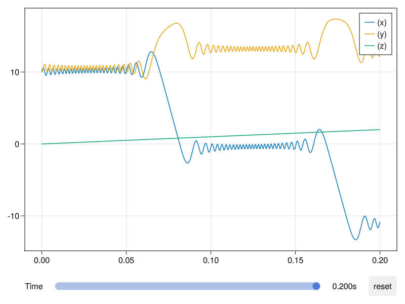
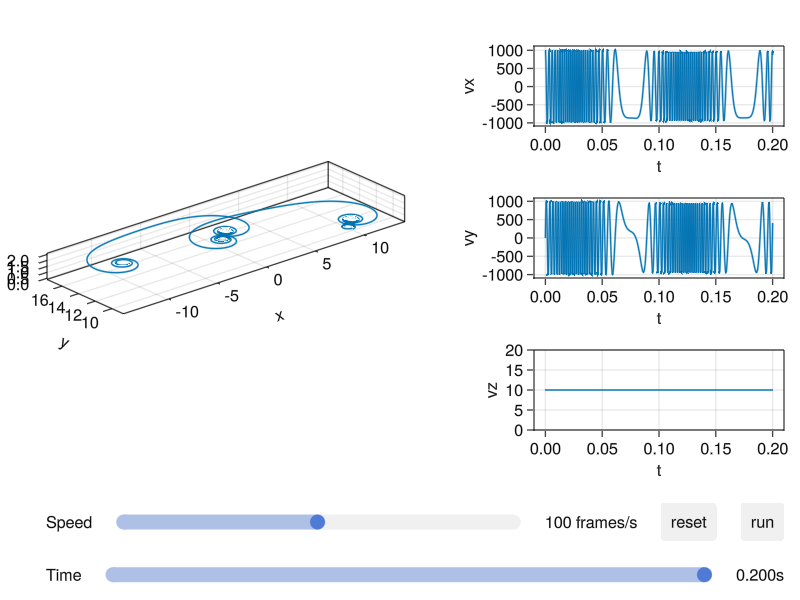

# Introduction

Test particle methods are widely used in plasma physics to understand the behavior of individual charged particles in prescribed electromagnetic fields. This approach assumes that the fields are not affected by the particles themselves, which is a valid approximation when the particle density is sufficiently low.

What makes plasmas particularly difficult to analyze is the fact that the densities fall in an intermediate range. Fluids like water are so dense that the motions of individual molecules do not have to be considered. Collisions dominate, and the simple equations of ordinary fluid dynamics suffice. At the other extreme in very low-density devices, only single-particle trajectories need to be considered; collective effects are often unimportant. Plasma behaves sometimes like fluids, and sometimes like a collection of individual particles. The first step in learning how to deal with this schizophrenic personality is to understand how single particles behave in electric and magnetic fields.

Here we assume that the EM fields are prescribed and not affected by the charged particles. References can be found in classic textbooks like [Introduction to Plasma Physics and Controlled Fusion](https://link.springer.com/book/10.1007/978-3-319-22309-4) by F.F.Chen, and [Fundamentals of Plasma Physics](https://doi.org/10.1017/CBO9780511807183) by Paul Bellan. For more complete notes corresponding to the derivation online, please check out [Single-Particle Motions](https://henry2004y.github.io/KeyNotes/contents/single.html).

## Equations of Motion

The motion of a particle with mass $m$ and charge $q$ in an electric field $\mathbf{E}$ and a magnetic field $\mathbf{B}$ is governed by the Lorentz force:

```math
\frac{d\mathbf{p}}{dt} = q(\mathbf{E} + \mathbf{v} \times \mathbf{B})
```

where $\mathbf{p} = \gamma m \mathbf{v}$ is the relativistic momentum, and $\gamma = 1/\sqrt{1 - v^2/c^2}$ is the Lorentz factor. For non-relativistic cases, $\gamma \approx 1$ and $\mathbf{p} = m \mathbf{v}$.


*Figure 1: Illustration of the Lorentz force on a charged particle (Placeholder).*

## Characteristic Scales

The behavior of a particle is often characterized by its gyroradius (or Larmor radius) $\rho_L$ and gyrofrequency $\Omega_c$:

```math
\Omega_c = \frac{|q|B}{m}, \quad \rho_L = \frac{v_\perp}{\Omega_c}
```

When the characteristic scale of field variations $L$ is much larger than the Larmor radius ($L \gg \rho_L$), the particle's motion can be averaged over its gyro-orbit, leading to the Guiding Center Approximation (GCA).


*Figure 2: Helical motion of a charged particle in a uniform magnetic field (Placeholder).*

## Quick Start

To get started with `TestParticle.jl`, you can trace a simple proton in a uniform magnetic field:

```julia
using TestParticle, OrdinaryDiffEq, StaticArrays

# 1. Define Fields
B(x, t) = SA[0, 0, 1e-8]  # Magnetic field (Tesla)
E(x, t) = SA[0, 0, 0]     # Electric field (V/m)

# 2. Define Initial Conditions
x0 = [1.0, 0.0, 0.0]      # Initial position (m)
v0 = [0.0, 1.0, 0.1]      # Initial velocity (m/s)
stateinit = [x0..., v0...]
tspan = (0, 20)           # Time span (s)

# 3. Prepare and Solve
param = prepare(E, B, species=Proton)
prob = ODEProblem(trace!, stateinit, tspan, param)
sol = solve(prob, Vern9())

# 4. Visualize (Requires Makie or Plots)
# using GLMakie
# plot(sol, idxs=(1, 2, 3))
```

For more complex scenarios and detailed explanations, please refer to the following sections.
